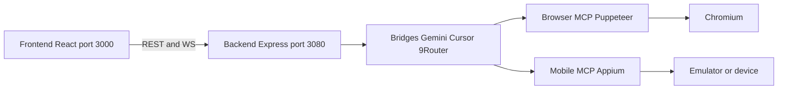

# Knitto Agent Automation

Aplikasi otomatisasi **browser** dan **Android (mobile)** untuk menjelajahi dan menguji sistem internal Knitto (`knitto.co.id`, CMS, dll.) menggunakan AI agent + Puppeteer untuk browser dan Appium + ADB + UIAutomator2 + emulator bluestack untuk mobile app

Arsitektur **monorepo** (Turborepo + pnpm): React frontend dan Express backend terpisah, berkomunikasi lewat REST + WebSocket. Protokol & tipe dibagi lewat package `@knitto/shared`.

---

## Fitur Utama


| Area                   | Kemampuan                                                              |
| ---------------------- | ---------------------------------------------------------------------- |
| **Browser automation** | Puppeteer + semantic locator, snapshot, rekaman video per job/TC       |
| **Mobile automation**  | Appium UiAutomator2 + ADB, device pool, rekaman layar                  |
| **Hybrid multi-TC**    | Satu prompt → beberapa test case lintas browser/mobile; 1 TC = 1 video |
| **AI bridges**         | Gemini, Cursor SDK, 9Router — tool calling lewat MCP                   |
| **Prompt shortcuts**   | Template Knitto di `prompt-shortcuts/` dengan variabel                 |
| **Agent memory**       | Learning per app (`memory/` / `memory/mobile/`), upsert section        |
| **File manager**       | Lampiran prompt dari `storage/`                                        |
| **Web UI**             | Chat, progress WS, screenshot/video, credentials, platform Hybrid      |


> Detail spesifikasi: [features](docs/features.md).

---


## Tech Stack


| Layer              | Teknologi                                            |
| ------------------ | ---------------------------------------------------- |
| Frontend           | React, TypeScript, Vite, Tailwind CSS v4, TipTap     |
| Backend            | Node.js 24, Express, WebSocket                       |
| Browser automation | Puppeteer, puppeteer-screen-recorder, ffmpeg         |
| Mobile automation  | Appium 3, UiAutomator2, WebdriverIO, ADB             |
| AI                 | Gemini (`@google/genai`), Cursor SDK, 9Router HTTP   |
| Protocol           | MCP (Model Context Protocol), Zod (`@knitto/shared`) |
| Monorepo           | Turborepo + pnpm workspaces                          |
| Deploy             | Docker Compose (Appium + backend + frontend/nginx)   |


---


## Prasyarat


### Development lokal

- **Node.js** **24.16.0** (lihat `.nvmrc`; `corepack enable`)
- **pnpm** **11.5.2** (`packageManager` di root `package.json`)
- **ffmpeg** di PATH — wajib untuk rekaman video browser
- API key: Gemini dan/atau Cursor (Web UI atau `.env`); 9Router opsional
- **Mobile (lokal):** Appium **wajib diinstal global** di host (bukan lewat `pnpm install` monorepo) + driver **UiAutomator2** + **`ANDROID_HOME`** + **ADB** di PATH. Alternatif: pakai Appium di Docker (`pnpm docker:appium` / `pnpm docker:up`) tanpa Appium global


### Docker

- Docker Desktop / Engine **24+** + Compose v2
- Untuk mobile: emulator/BlueStacks di **host**; stack Compose menyediakan Appium

---


## Memulai


### 1. Install dependensi

```bash
corepack enable
corepack prepare pnpm@11.5.2 --activate
pnpm install
```


### 2. Konfigurasi environment

```bash
cp apps/backend/.env.example apps/backend/.env
cp apps/frontend/.env.example apps/frontend/.env
```

Pastikan `BACKEND_PORT` selaras dengan `VITE_BACKEND_PORT` / `VITE_WS_PORT`.

Variabel penting (lokal):


| Variabel                            | Deskripsi              | Default                 |
| ----------------------------------- | ---------------------- | ----------------------- |
| `BACKEND_PORT`                      | Port HTTP + WS backend | `3080`                  |
| Agent API keys | Settings → Agent credentials (localStorage) | — |
| `AUTOMATION_HEADLESS`               | Browser headless       | `false` (lokal)         |
| `APPIUM_SERVER_URL`                 | Appium (host global)   | `http://127.0.0.1:4723` |


Tabel lengkap: [environment.md](docs/environment.md).

### 3. Appium global (mobile lokal)

Appium **tidak** ikut monorepo. Untuk platform Mobile/Hybrid di `pnpm dev`, install sekali di mesin:

```bash
# 1) Appium server (global)
npm i -g appium@3.1.0

# 2) Driver UiAutomator2 (wajib)
appium driver install uiautomator2@4.2.3

# 3) Pastikan Android SDK
#    Windows contoh: ANDROID_HOME=%LOCALAPPDATA%\Android\Sdk
#    Pastikan platform-tools (adb) di PATH: adb devices
```

Jalankan Appium di **terminal terpisah** sebelum / bersamaan `pnpm dev`:

```bash
appium --address 127.0.0.1 --port 4723 --base-path / --relaxed-security --allow-insecure adb_shell
```

Cek: [http://127.0.0.1:4723/status](http://127.0.0.1:4723/status) → `"ready": true`.

| Mode | Appium |
|------|--------|
| Dev lokal + mobile | **Global** di host (langkah di atas) |
| Docker | Service Compose — **tidak** perlu Appium global; matikan Appium host di port `4723` agar tidak bentrok |

Detail: [mobile.md](docs/mobile.md). Docker + ADB: [docker.md](docs/docker.md).

### 4. Mode development

```bash
pnpm dev
```

Atau terpisah:

```bash
pnpm dev:frontend   # Vite — http://localhost:3000
pnpm dev:backend    # Express — http://localhost:3080
```


| Layanan              | URL                                                                  |
| -------------------- | -------------------------------------------------------------------- |
| Web UI               | [http://localhost:3000](http://localhost:3000)                       |
| Backend health       | [http://localhost:3080/api/health](http://localhost:3080/api/health) |
| Appium (host/Docker) | [http://127.0.0.1:4723/status](http://127.0.0.1:4723/status)         |


Backend lokal mengarah ke Appium lewat `APPIUM_SERVER_URL` (default `http://127.0.0.1:4723`).

### 5. Production lokal

```bash
pnpm build
pnpm start          # backend
pnpm preview        # frontend static (opsional)
```


### 6. Docker Compose

```bash
cp .env.example .env   # secret, port, ADB_CONNECT_TARGETS
pnpm docker:up         # appium + backend + frontend
```

Panduan lengkap (ADB dual-path, checklist BlueStacks): [docker.md](docs/docker.md).

---


## Struktur Monorepo

```
knitto-agent-browser/
├── apps/
│   ├── frontend/              # @knitto/frontend — React + Vite
│   └── backend/               # @knitto/backend — Express + automation MCP
├── packages/
│   └── shared/                # @knitto/shared — Zod schemas + types
├── docker/
│   ├── nginx.conf
│   └── appium/                # Appium 3 + UiAutomator2 image
├── docs/                      # system, features, browser, mobile, docker, …
├── prompt-shortcuts/          # Template prompt
├── scripts/bluestacks/        # Launch / ADB BlueStacks (Windows)
├── memory/                    # Agent memory (web + mobile/)
├── storage/                   # File manager
├── screenshoot/agents/        # Screenshot & video per job
├── Dockerfile
├── docker-compose.yml
├── docker.env
└── .env.example
```


### Arsitektur singkat




Satu proses backend menjalankan HTTP, WebSocket, dan semua bridge. Gemini/9Router memakai MCP **in-process**; Cursor men-spawn MCP via **stdio**. Detail: [system.md](docs/system.md).

---


## Perintah yang Tersedia


| Perintah                               | Deskripsi                            |
| -------------------------------------- | ------------------------------------ |
| `pnpm dev`                             | Frontend + backend (Turbo)           |
| `pnpm dev:frontend` / `dev:backend`    | Satu app saja                        |
| `pnpm build` / `typecheck`             | Build / typecheck workspace          |
| `pnpm start` / `preview`               | Backend production / preview UI      |
| `pnpm instances:up` / `instances:down` | BlueStacks + ADB (Windows)           |
| `pnpm docker:up`                       | Compose: Appium + backend + frontend |
| `pnpm docker:appium`                   | Hanya service Appium                 |
| `pnpm docker:down` / `docker:logs`     | Stop / follow logs                   |


---


## Penggunaan singkat (Web UI)

1. Buka [http://localhost:3000](http://localhost:3000) → **Connect** (host/port backend)
2. Simpan credentials bridge → pilih model
3. Platform **Browser**, **Mobile**, atau **Hybrid**
4. Prompt / Knitto Shortcuts → kirim; pantau chat, screenshot, video

Semantic locator (bukan CSS): ref snapshot (`e12`), `role` + `name`, teks terlihat. Lihat `memory/` dan `prompt-shortcuts/`.

---


## Dokumentasi

Indeks lengkap: **[docs/README.md](docs/README.md)**.


| Dokumen | Isi |
| ------- | --- |
| [docs/README.md](docs/README.md) | Summary & indeks seluruh dokumentasi |
| [system.md](docs/system.md) | Arsitektur sistem & monorepo |
| [features.md](docs/features.md) | Spesifikasi fitur utama |
| [browser.md](docs/browser.md) | Puppeteer, recording, locator |
| [mobile.md](docs/mobile.md) | Appium, ADB, device pool |
| [hybrid.md](docs/hybrid.md) | Multi-TC orchestrator & segment video |
| [mcp.md](docs/mcp.md) | MCP tools (browser + mobile), in-process vs Cursor stdio |
| [docker.md](docs/docker.md) | Compose, dual ADB, checklist |
| [environment.md](docs/environment.md) | Tabel environment variables |
| [api.md](docs/api.md) | REST + WebSocket |
| [troubleshooting.md](docs/troubleshooting.md) | Gejala & solusi |


---


## Prinsip Pengembangan

- **Shared contracts** — tipe & Zod di `@knitto/shared`, bukan duplikasi di FE/BE
- **Tool-first automation** — agent beroperasi lewat MCP tools berschema, bukan script ad-hoc di UI
- **Platform isolation** — browser vs mobile MCP terpisah; hybrid digabung di orchestrator
- **Evidence by default** — screenshot + video per job/TC di `screenshoot/agents/`
- **Ops clarity** — Docker Appium vs Appium host eksplisit; dual-path ADB terdokumentasi

---


## Lisensi

Proyek ini bersifat **private** (`"private": true`). Hak cipta © Knitto / knittotextile.