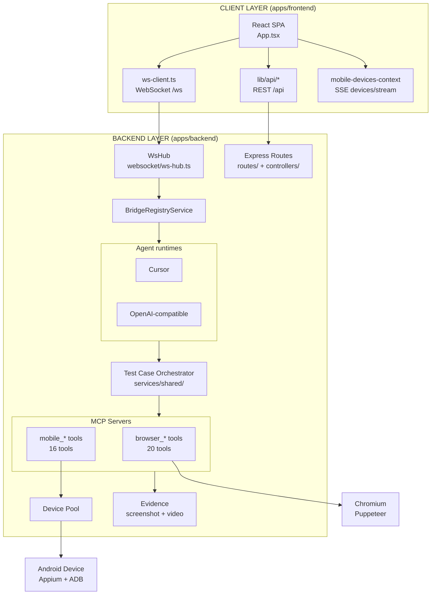
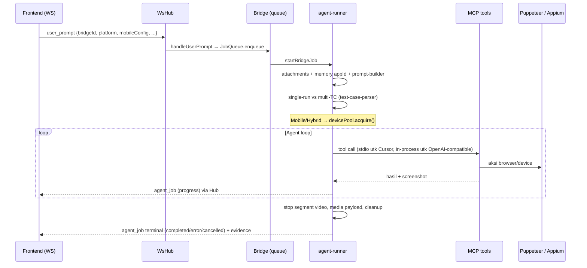

# Arsitektur Level Service & Katalog Tools

Dokumen ini memetakan arsitektur **knitto-agent-automation** pada level service — dikategorikan menjadi **Client Layer** (frontend) dan **Backend Layer** — serta cara memakai seluruh tools (MCP) yang terdaftar di workspace ini.

Terkait: [system.md](system.md) (arsitektur umum), [mcp.md](mcp.md) (katalog MCP), [api.md](api.md) (REST/WS), [hybrid.md](hybrid.md) (multi test case).

---

## 1. Gambaran Besar

Monorepo Turborepo + pnpm dengan tiga workspace:

| Workspace | Paket | Peran |
|---|---|---|
| `apps/frontend` | `@knitto/frontend` | React 19 + Vite + Tailwind v4 — UI chat untuk membuat & memantau job otomasi |
| `apps/backend` | `@knitto/backend` | Express + WebSocket hub + AI bridges + MCP server (Puppeteer & Appium) |
| `packages/shared` | `@knitto/shared` | Kontrak bersama (Zod schema, tipe protokol WS, parser test case) |

Prinsip pembagian transport (lihat [api.md](api.md)):
- **WebSocket `/ws`** — satu-satunya jalur pengiriman prompt/job dan streaming progresnya.
- **REST `/api`** — data pendukung (health, bridges, shortcuts, memory, file manager, device, evidence).
- **SSE `/api/mobile/devices/stream`** — daftar device Android live.

---

## 2. Client Layer (`apps/frontend`)

### 2.1 Stack & entry point

- React 19 + TypeScript, Vite 5, Tailwind CSS v4, TanStack React Query v5, TipTap 3 (editor prompt), `@base-ui/react`.
- Entry: `src/main.tsx` → `src/App.tsx`. **SPA tanpa router** — semua orkestrasi state ada di `App.tsx`.
- State disimpan di `localStorage` key `knitto-automation-web` (kecuali kredensial runtime).

### 2.2 Sub-layer client

| Sub-layer | Lokasi | Tanggung jawab |
|---|---|---|
| Transport WS | `src/lib/ws-client.ts` (`AutomationWsClient`) | Koneksi `/ws`, kirim `user_prompt` / `agent_job_cancel` / `bridge_credentials`, terima `agent_job` / `bridges_snapshot` / `bridge_status` |
| Transport REST | `src/lib/http/client.ts` + `src/lib/api/*` | fetch wrapper + modul per resource (file-manager, mobile-device, app-memory, prompt-shortcuts) |
| Transport SSE | `src/contexts/mobile-devices-context.tsx` | `EventSource` device list, aktif hanya saat platform Mobile/Hybrid |
| State job | `src/lib/types.ts`, `merge-agent-chat-line.ts`, `active-jobs.ts` | `chatLines[]`, merge pesan `agent_job` streaming, tracking job aktif/terminal |
| Server state | `src/query/*` + `src/hooks/*` | React Query untuk shortcuts, memory, packages, file entries |
| Komposisi prompt | `prompt-editor.tsx`, `prompt-compose.ts`, `parse-test-cases.ts` | TipTap, shortcuts, attachments (maks 4), pre-parse `## Test Case N` untuk Hybrid |
| UI monitoring | `job-progress.tsx`, `test-case-result-stack.tsx`, `agent-screenshot.tsx`, `agent-videos.tsx` | Badge status, checklist per-TC, screenshot zoomable, video hasil |
| Settings | `settings-modal.tsx` (Connection, Bridge credentials, Prompt shortcuts, Memory) | Konfigurasi koneksi & kredensial |
| File manager | `components/file-manager/*` | Browse/upload storage `storage/` untuk attachment |

### 2.3 Alur pemakaian dari UI

1. **Connect** — panel koneksi (`connection-panel.tsx`) → WS join channel → `refresh_status` → terima `bridges_snapshot`.
2. **Kredensial & model** — Settings → Agent credentials (Cursor / OpenAI-compatible), pilih model.
3. **Pilih platform** — Browser / Mobile (pilih device + package dari SSE, opsional deep link) / Hybrid.
4. **Compose & Send** — prompt + shortcuts + attachments → `App.handleSend` membuat `job-<ts>-<rand>` dan kirim `user_prompt` via WS.
5. **Monitor** — stream `agent_job`: status, checklist per-TC, nama tool yang sedang jalan, screenshot/video live.
6. **Hasil** — kartu hasil per-TC + evidence dari `GET /api/agent-screenshots/:jobId/:filename` dan `/api/agent-videos/:jobId/:filename`.
7. **Cancel** — `agent_job_cancel` via WS.

---

## 3. Backend Layer (`apps/backend`)

Entry: `src/server.ts` → `src/app.ts` (HTTP `:3080` + WS hub dalam satu proses).

### 3.1 Peta service

| # | Layer | Folder / file kunci | Tanggung jawab |
|---|---|---|---|
| 1 | HTTP bootstrap | `src/server.ts`, `src/app.ts` | Boot server, wiring `BridgeRegistryService` + `WsHub`, mount `/api`, CORS, error handler |
| 2 | Routing + controller | `src/routes/index.ts` (+11 route), `src/controllers/*` | REST per resource (lihat §3.3) |
| 3 | WebSocket hub | `src/websocket/ws-hub.ts` | Channel join, terima `user_prompt`/`cancel`/`credentials`, broadcast status bridge & progres job |
| 4 | Agent registry & runners | `src/services/bridge-registry.service.ts`, `src/services/bridge-runners/{cursor,ninerouter}/` | 2 runtime: Cursor + OpenAI-compatible (knitto-agent); tiap runtime punya `*-bridge.service.ts` + `agent-runner.ts` |
| 5 | Orkestrasi bersama | `src/services/shared/` | `queue.ts` (JobQueue), `prompt-builder.ts`, `test-case-orchestrator.ts` + `test-case-parser.ts` (multi-TC/hybrid), `automation-mcp-client.ts`/`automation-mcp-config.ts` (transport MCP), `segment-recording.ts`, `handoff.ts`, `persist-attachments.ts`, cleanup mobile/browser |
| 6 | Browser automation | `src/automation/` | MCP server (stdio `mcp-stdio-server.ts` + `in-process-mcp-client.ts`), registry tools (`libs/registry.ts`), Puppeteer (`libs/browser/{session,snapshot,interactions,locators,screenshot,recording}.ts`) |
| 7 | Mobile automation | `src/mobile-automation/` | MCP server (stdio + in-process), Appium driver (`libs/driver/session.ts`), ADB (`libs/adb/*`), recovery instrumentation-crash/device-offline |
| 8 | Device pool | `src/mobile-automation/libs/driver/device-pool.ts` | Singleton pool di atas `adb devices`: acquire/release per job, allowlist, round-robin, health check (`pingDevice`) |
| 9 | Evidence | `src/services/agent-screenshots.ts`, `agent-videos.ts`, `services/shared/tool-screenshot.ts`, `segment-recording.ts` | Tulis & serve `screenshoot/agents/{jobId}/` (PNG + `recording.mp4` atau `tc-NN.mp4`) |
| 10 | Live device snapshot | `src/services/mobile-device-snapshot-hub.ts` | SSE streaming daftar/status device ke UI |
| 11 | Storage / file manager | `src/services/storage/*` (`local-storage-adapter.ts`, `file-manager-service.ts`) | CRUD file `storage/`, eligibility attachment |
| 12 | App memory | `src/services/app-memory-service.ts`, `mobile-app-memory-service.ts` | Memory markdown per app: `memory/{appId}.md` (browser), `memory/mobile/{package}.md` |
| 13 | Prompt shortcuts | `src/services/prompt-shortcut-service.ts`, `prompt-shortcut-generate.service.ts` | CRUD + generate template prompt via AI |
| 14 | Config | `src/config/{env,paths,storage-env}.ts` | Parse env, resolusi path |

### 3.2 Alur job end-to-end

Detail per langkah:

1. **Entry**: `WsHub.handleAgentFromWeb` validasi bridge → `bridge.handleUserPrompt(msg)`.
2. **Queue**: `services/shared/queue.ts`, konkurensi `KNITTO_BRIDGE_MAX_CONCURRENT` (default 1).
3. **Runner**: `bridge-runners/{cursor,ninerouter}/agent-runner.ts` — resolve attachment (`persist-attachments.ts`), memory, build prompt (`prompt-builder.ts`); prompt multi-TC (`## Test Case N`) diarahkan ke `executeMultiTestBridgeJob` (`multi-test-bridge.ts` + `test-case-orchestrator.ts`).
4. **Transport MCP** — perbedaan penting per runtime:
   - **Cursor**: MCP **stdio** (`automation-mcp-config.ts` → spawn `mcp-stdio-server.ts`; `@cursor/sdk` men-drive loop).
   - **OpenAI-compatible**: MCP **in-process** (`automation-mcp-client.ts` → `in-process-mcp-client.ts`) + knitto-agent `Agent` loop.
5. **Driver**: handler tool memanggil `automation/libs/browser/*` (Puppeteer) atau `mobile-automation/libs/driver/*` (Appium) + `libs/adb/*`.
6. **Evidence**: screenshot & video ke `screenshoot/agents/{jobId}/`; segmen per-TC dihentikan lewat tool `*_stop_test_case_segment` + `segment-stop-poller.ts`.
7. **Cleanup**: `mcp-browser.ts#closeAutomationBrowser`, `mobile-job-cleanup.ts`, release device pool, `cleanupJobAttachments`.

### 3.3 REST API (semua di bawah `/api`)

| Method | Path | Fungsi |
|---|---|---|
| GET | `/api/health` | Health check |
| GET | `/api/bridges` | Daftar AI bridge |
| GET | `/api/config/public` | Konfigurasi publik runtime |
| GET/POST, GET/PUT/DELETE | `/api/app-memory`, `/api/app-memory/:appId` | Memory browser per app |
| GET/POST, GET/PUT/DELETE | `/api/mobile/app-memory`, `/api/mobile/app-memory/:appId` | Memory mobile per package |
| GET | `/api/mobile/devices` · `/devices/stream` (SSE) · `/devices/:udid/packages` · `.../packages/:pkg/activity` | Device pool, live stream, daftar package, activity launchable |
| GET/POST/PUT/DELETE | `/api/prompt-shortcuts`, `/:id`, `POST /generate` | CRUD + AI-generate shortcut |
| GET/POST/PATCH/DELETE | `/api/file-manager/entries` · `/files/content` · `/files/serve` · `/files` (upload) · `/folders` | File manager `storage/` |
| GET | `/api/agent-screenshots/:jobId/:filename` · `/api/agent-videos/:jobId/:filename` | Serve evidence |

> Pengiriman job **tidak** lewat REST — hanya lewat WS `user_prompt`.

### 3.4 Kontrak bersama (`packages/shared`)

Barrel `src/index.ts` → `src/protocol/`:

- `bridge.ts` — schema Zod protokol WS/job: `UserPromptMessage`, `AgentJobMessage`, `BridgeInfo`, `MobileConfig`, `AutomationPlatform`, `TestCaseResult`, dll.
- `test-case.ts` — `parseTestCasesFromPrompt`, `validateHybridPrompt`, `resolveMemoryAppId`, `MAX_TEST_CASES = 5`.
- `test-case-results.ts` — builder markdown hasil multi-TC.
- `prompt-template.ts` / `prompt-compose.ts` — template & merge prompt.
- `constants.ts` — `STRATEGIES`, default host/port/channel. ⚠️ **Catatan drift**: default WS/HTTP di `constants.ts` masih `8080`, padahal backend nyata default `3080` (`config/env.ts`).
- `file-manager.ts` — schema entri storage.

Dikonsumsi backend (runners, ws-hub, orchestrator) dan frontend (±27 file) — satu-satunya sumber kebenaran kontrak FE↔BE.

---

## 4. Katalog Tools MCP & Cara Pakai

Dua MCP server, keduanya dibangun via `automation/core/server.ts` (`registerTool`) dengan pola `defineTool({name, description, inputSchema, outputSchema, handler})`. Tools inilah yang dipanggil AI agent selama job — **bukan** dipanggil manusia langsung; cara "memakai"-nya adalah lewat prompt (agent memilih tool sendiri), atau saat menambah/mengubah tool ikuti pola registrasi di bawah.

### 4.1 Browser tools (prefix `browser_*`) — 20 tools

Registrasi: `automation/mcp-stdio-server.ts` (stdio, Cursor) & `automation/libs/registry.ts` / `in-process-mcp-client.ts` (OpenAI-compatible). Sumber tiap tool di `automation/libs/tools/`. Nama publik tool = `browser_*` (W6).

Bentuk **locator** (semua field opsional, minimal satu): `{ ref, role, name, label, placeholder, text }` — strategi semantik (snapshot ref / role+name / teks), **bukan** CSS selector. Alur idiomatis: `get_page_snapshot` dulu → pakai `ref` hasilnya. Default snapshot: `interactiveOnly=true`, `maxDepth=6`, `maxElements=200`.

| Tool | Parameter | Kegunaan |
|---|---|---|
| `browser_get_app_memory` | `appId` | Baca memory markdown app web |
| `browser_update_app_memory` | `appId, content, mode(replace\|upsert_section), sectionKey?` | Simpan learnings |
| `browser_navigate` | `url, waitUntil?` | Buka URL |
| `browser_get_page_snapshot` | `maxDepth?(=6), interactiveOnly?(=true), maxElements?(=200)` | Snapshot aksesibilitas + refs |
| `browser_click` | `locator, clickCenter?(=false)` | Klik elemen |
| `browser_click_at` | `x, y` | Klik koordinat (fallback) |
| `browser_fill` | `locator, value, clear?(=true)` | Isi input |
| `browser_assert_text` | `text, match(contains\|exact\|regex)` | Assert teks halaman |
| `browser_assert_visible` | `locator` | Assert elemen terlihat |
| `browser_take_screenshot` | `fullPage?(=false), path?` | Screenshot PNG (evidence) |
| `browser_scroll` | `direction(up\|down\|top\|bottom), amount?, locator?, smooth?` | Scroll halaman/elemen |
| `browser_press_key` | `key` (Escape dilarang), `locator?` | Tekan tombol keyboard |
| `browser_hover` | `locator` | Hover |
| `browser_select_option` | `locator, value` | Pilih opsi select/combo |
| `browser_wait_for` | `type(text\|locator\|network_idle\|timeout), text?, locator?, match?, timeoutMs?` | Tunggu kondisi |
| `browser_go_back` / `browser_go_forward` | — | Navigasi history |
| `browser_upload_file` | `locator, filePath` (absolut) | Upload ke file input |
| `browser_close_browser` | — | Tutup sesi Puppeteer |
| `browser_stop_test_case_segment` | `testCaseId?` | Hentikan segmen video per-TC (multi-TC) |

### 4.2 Mobile tools (prefix `mobile_*`) — 16 tools

Registrasi: `mobile-automation/mcp-stdio-server.ts` & `mobile-automation/libs/registry.ts`. Locator mobile: `{ ref, accessibilityId, text, name }`. Alur idiomatis: `mobile_launch_app` → `mobile_get_screen_snapshot` → interaksi via `ref`.

| Tool | Parameter | Kegunaan |
|---|---|---|
| `mobile_launch_app` | `{}` (package/deepLink dari env job) | Launch/activate app target |
| `mobile_get_screen_snapshot` | `interactiveOnly?(=true), maxElements?(=200)` | Snapshot UI-tree + refs |
| `mobile_tap` | `locator, clickCenter?(=true)` | Tap elemen |
| `mobile_tap_at` | `x, y` | Tap koordinat |
| `mobile_scroll` | `direction, amount?, locator?` | Scroll/swipe |
| `mobile_input_text` | `locator, value, clear?(=true), hideKeyboard?(=true)` | Isi EditText |
| `mobile_take_screenshot` | `path?` | Screenshot PNG |
| `mobile_upload_file` | `locator, filePath` | `adb push` + set path input |
| `mobile_get_app_memory` / `mobile_update_app_memory` | `appId(=appPackage), ...` | Baca/simpan memory mobile |
| `mobile_press_key` | `key(BACK\|HOME\|ENTER\|TAB\|DEL\|MENU)` | Tombol Android |
| `mobile_assert_visible` | `locator` | Assert elemen terlihat |
| `mobile_wait_for` | `type(locator\|text\|timeout), ...` | Tunggu kondisi |
| `mobile_close_app` | `{}` | `terminateApp` (sesi tetap hidup) |
| `mobile_close_session` | `{}` | Tutup sesi Appium + release device pool |
| `mobile_stop_test_case_segment` | `testCaseId?` | Hentikan segmen video per-TC |

### 4.3 Dua mode transport & catatan drift

| Mode | Dipakai oleh | File | Catatan |
|---|---|---|---|
| **Stdio subprocess** | Cursor | `*/mcp-stdio-server.ts` (env per job via `automation-mcp-config.ts`) | Katalog lengkap (20 browser / 16 mobile) |
| **In-process** | OpenAI-compatible | `*/in-process-mcp-client.ts` | Parity dengan stdio (termasuk `*_stop_test_case_segment`) |

Perilaku multi-TC/cleanup dikendalikan env job: `AUTOMATION_MULTI_TC` / `MOBILE_MULTI_TC`, `AUTOMATION_FORCE_CLOSE` / `MOBILE_FORCE_CLOSE`.

### 4.4 Cara memakai tools dalam praktik

- **Sebagai pengguna (QA)**: tidak memanggil tool langsung — tulis prompt di UI (mis. "buka situs X, login, assert dashboard tampil"), agent yang memilih & memanggil tools. Untuk multi-TC gunakan format `## Test Case N` + `Platform:` + `App:`/`Url:` + `[HANDOFF] KEY=value` ([hybrid.md](hybrid.md); maks 5 TC/prompt).
- **Sebagai developer, menambah tool baru**:
  1. Buat file di `automation/libs/tools/` atau `mobile-automation/libs/tools/` dengan `defineTool` (schema Zod di `libs/schema.ts`).
  2. Daftarkan di `libs/registry.ts`, `mcp-stdio-server.ts`, **dan** `in-process-mcp-client.ts` (dua transport — jangan lupa keduanya, ini sumber drift yang sudah terjadi).
  3. Perbarui katalog di [mcp.md](mcp.md).

---

## 5. Konfigurasi & Environment Penting

Ringkas (lengkapnya di [environment.md](environment.md)):

| Grup | Variabel kunci |
|---|---|
| Server | `BACKEND_HOST` (0.0.0.0), `BACKEND_PORT` (3080), `VITE_DEV_PORT` (3000), `VITE_BASE_URL_BACKEND` |
| Agents | Credentials via Web UI (not env). `KNITTO_BRIDGE_MODEL`, `KNITTO_BRIDGE_MAX_CONCURRENT` (1), `KNITTO_BRIDGE_JOB_TIMEOUT_MS` (600000), `KNITTO_BRIDGE_MAX_TOOL_CALLS` (40) |
| Browser | `AUTOMATION_HEADLESS`, `AUTOMATION_RECORD_VIDEO` (true), `AUTOMATION_VIEWPORT_*`, `AUTOMATION_MCP_COMMAND/_PATH`, `PUPPETEER_EXECUTABLE_PATH` |
| Mobile | `APPIUM_SERVER_URL` (http://127.0.0.1:4723), `ADB_SERVER_SOCKET`, `MOBILE_DEVICE_UDIDS` (allowlist pool), `MOBILE_DEVICE_ACQUIRE_TIMEOUT_MS` (60000), `MOBILE_RECORD_VIDEO` (true) |
| Storage | `STORAGE_ROOT` (./storage), `STORAGE_MAX_UPLOAD_BYTES` (50MB) |

Persistensi on-disk: `memory/` (memory app), `prompt-shortcuts/`, `storage/` (file manager), `screenshoot/agents/{jobId}/` (evidence — job tunggal `recording.mp4`, multi-TC `tc-NN.mp4` + `tc-NN-*.png` + `.segment-state.json`).

---

## 6. Menjalankan Workspace

| Mode | Perintah | Catatan |
|---|---|---|
| Dev lokal | `pnpm install` → `pnpm dev` | FE `:3000`, BE `:3080`. **Tidak** menyalakan Appium/emulator — mobile butuh `appium --address 127.0.0.1 --port 4723 --relaxed-security --allow-insecure adb_shell` terpisah + device ter-`adb connect` (verifikasi `adb shell echo ok`) |
| Docker | `cp .env.example .env` → `pnpm docker:up` | 3 service: appium (:4723), backend (:3080), frontend/nginx (:3000→80). Emulator tetap di host; perhatikan dual-ADB path ([docker.md](docker.md) §4) |
| Produksi lokal | `pnpm build` → `pnpm start` + `pnpm preview` | Build order: shared → backend/frontend |
| BlueStacks helper | `pnpm instances:up` / `instances:down` | Skrip `scripts/bluestacks/` |

Verifikasi cepat: `curl :3080/api/health`, Appium `GET :4723/status`. Gotcha operasional (BlueStacks ADB reset, log buffered, RAM/OOM) ada di [CLAUDE.md](../CLAUDE.md) dan [troubleshooting.md](troubleshooting.md).
