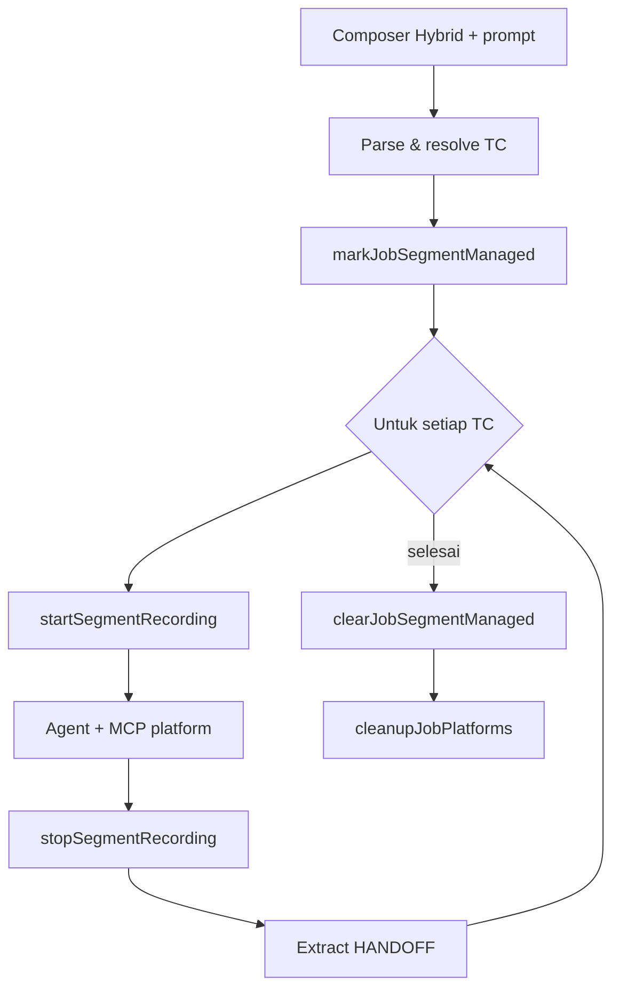

# Multi Test Case & Orchestrator

---

## Pendahuluan

Dokumen ini menjelaskan mode **Hybrid**: satu prompt menjalankan beberapa test case lintas **browser** dan/atau **mobile**, dengan bukti video terpisah per TC.

---

## Tujuan Dokumen

- Mendefinisikan kontrak prompt TC, handoff, dan segment recording
- Memberi contoh prompt multi-TC siap pakai / diadaptasi
- Menjelaskan perbedaan cleanup Cursor vs in-process
- Menjadi acuan perubahan orchestrator

---

## Ruang Lingkup

Mencakup: parse TC, segment state, close guard, handoff, UI results. Spesifikasi fitur terkait: [features.md](features.md).

---

## 1. Konsep

| Konsep | Arti |
|--------|------|
| Test case | Heading `## Test Case N` — 1 video + 1 blok hasil |
| Shortcut | Template `prompt-shortcuts/*.md` |
| Handoff | `[HANDOFF] KEY=value` di summary TC sebelumnya |
| Segment | State di `screenshoot/agents/{jobId}/.segment-state.json` |
| Close guard | Agent tidak close platform di tengah multi-TC |

Batas: maks **5** TC / prompt; maks **5** shortcut / TC.

---

## 2. Alur job



Implementasi utama: `services/shared/test-case-orchestrator.ts`, `multi-test-bridge.ts`, `segment-*.ts`.

---

## 3. Platform resolve

Urutan tipikal: baris `Platform:` di TC → metadata shortcut → infer URL → default browser. Mobile wajib `appPackage` (shortcut / `App:` / fallback composer). Hybrid auto device/package dari TC mobile pertama bila applicable.

---

## 4. Cursor vs Gemini/9Router

| Aspek | Cursor | Gemini / 9Router |
|-------|--------|------------------|
| MCP | stdio subprocess | in-process |
| Stop segment | tool MCP + file poller | in-process |
| Cleanup | `cursor-subprocess` + `FORCE_CLOSE` | `callTool` in-process |

---

## 5. Evidence & UI

- Video: `tc-01.mp4`, …
- Screenshot prefix: `tc-01-*.png`
- Payload: `testCaseResults[]` (summary, screenshots, videoUrl)
- UI: stack vertikal per TC

---

## 6. Format baris di dalam TC

| Baris | Contoh | Arti |
|-------|--------|------|
| Heading | `## Test Case 1` | Wajib — satu heading = satu TC |
| Platform | `Platform: browser` / `Platform: mobile` | Override platform TC |
| App | `App: com.baseapprn.development` | Package Android (mobile) |
| Url | `Url: https://example.com/orders` | Override URL browser |
| Variabel | `qty_kg=1` | Isi `{qty_kg}` di shortcut |
| Shortcut (label) | `Ikuti system prompt "Take Order".` | Resolve by label di `prompt-shortcuts/` |
| Shortcut (id) | `shortcut:take-order` | Resolve by id file |
| Handoff (narratif) | minta agent tulis `[HANDOFF] no_order=...` di ringkasan | Dinikmati TC berikutnya |

Catatan: di UI pilih platform **Hybrid** sebelum kirim. Max 5 TC per prompt; max 5 shortcut per TC.

---

## 7. Contoh prompt

### 7.1 Hybrid browser → mobile (teks bebas + handoff)

```markdown
## Test Case 1
Platform: browser
Url: http://192.168.20.27:5367/
Login ke Take Order, buat order kain, lalu di ringkasan tulis tepat:
[HANDOFF] no_order=<nomor_order>

## Test Case 2
Platform: mobile
App: com.baseapprn.development
Buka app, cari order dari handoff no_order, verifikasi status tampil benar.
```

### 7.2 Multi shortcut berurutan dalam satu TC (CMS / Take Order)

Label harus sama dengan frontmatter `label` di `prompt-shortcuts/` (contoh: `Take Order - Login`, `Take Order`).

```markdown
## Test Case 1
Platform: browser
Ikuti system prompt "Take Order - Login" lalu system prompt "Take Order".
username=admin
password=secret
cabang=BANDUNG
order_dari=TOKO
cari_customer=28886351120
qty_kg=1
Setelah order sukses, ringkasan wajib berisi:
[HANDOFF] no_order=<nomor_order>

## Test Case 2
Platform: browser
Ikuti system prompt "Portal - Cek Status Order".
Pakai `no_order` dari handoff TC 1 (jangan hardcode).
```

### 7.3 Hybrid + shortcut id + override App

```markdown
## Test Case 1
Platform: browser
shortcut:cms-login
username=qa.automation
password=11221122

## Test Case 2
Platform: browser
Ikuti system prompt "Take Order".
cari_customer=28886351120
qty_kg=2
Di akhir tulis [HANDOFF] no_order=<nomor_order>

## Test Case 3
Platform: mobile
App: com.baseapprn.development
Cari order no_order dari handoff di daftar order app; screenshot bukti status.
```

### 7.4 Hanya browser (beberapa TC, tanpa mobile)

```markdown
## Test Case 1
Platform: browser
Ikuti system prompt "CMS - Login".
username=admin
password=11221122

## Test Case 2
Platform: browser
Url: http://192.168.20.27:5420/
Navigasi menu sesuai kebutuhan, verifikasi halaman terbuka; ambil screenshot.
```
