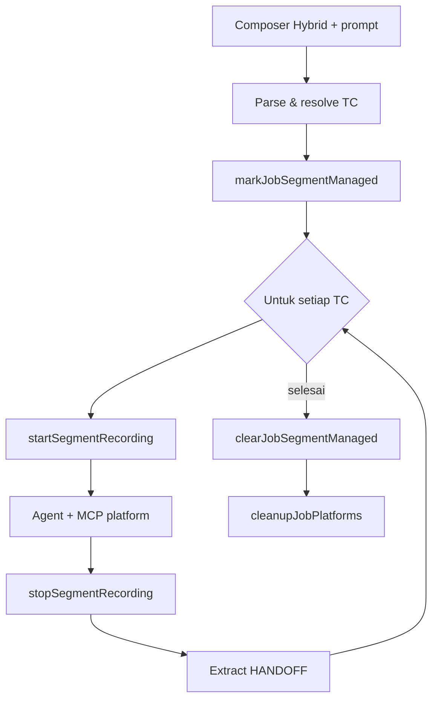

# Multi Test Case & Orchestrator

---

## Pendahuluan

Dokumen ini menjelaskan mode **Hybrid**: satu prompt menjalankan beberapa test case lintas **browser** dan/atau **mobile**, dengan bukti video terpisah per TC.

---

## Tujuan Dokumen

- Mendefinisikan kontrak prompt TC, handoff, dan segment recording
- Menjelaskan perbedaan cleanup Cursor vs in-process
- Menjadi acuan perubahan orchestrator

---

## Ruang Lingkup

Mencakup: parse TC, segment state, close guard, handoff, UI results. Spesifikasi fitur terkait: [features.md](features.md).

---

## 1. Konsep

| Konsep | Arti |
|--------|------|
| Test case | Heading `## Test Case N` — 1 video + 1 blok hasil |
| Shortcut | Template `prompt-shortcuts/*.md` |
| Handoff | `[HANDOFF] KEY=value` di summary TC sebelumnya |
| Segment | State di `screenshoot/agents/{jobId}/.segment-state.json` |
| Close guard | Agent tidak close platform di tengah multi-TC |

Batas: maks **5** TC / prompt; maks **5** shortcut / TC.

---

## 2. Alur job

Implementasi utama: `services/shared/test-case-orchestrator.ts`, `multi-test-bridge.ts`, `segment-*.ts`.

---

## 3. Platform resolve

Urutan tipikal: baris `Platform:` di TC → metadata shortcut → infer URL → default browser. Mobile wajib `appPackage` (shortcut / `App:` / fallback composer). Hybrid auto device/package dari TC mobile pertama bila applicable.

---

## 4. Cursor vs Gemini/9Router

| Aspek | Cursor | Gemini / 9Router |
|-------|--------|------------------|
| MCP | stdio subprocess | in-process |
| Stop segment | tool MCP + file poller | in-process |
| Cleanup | `cursor-subprocess` + `FORCE_CLOSE` | `callTool` in-process |

---

## 5. Evidence & UI

- Video: `tc-01.mp4`, …
- Screenshot prefix: `tc-01-*.png`
- Payload: `testCaseResults[]` (summary, screenshots, videoUrl)
- UI: stack vertikal per TC
