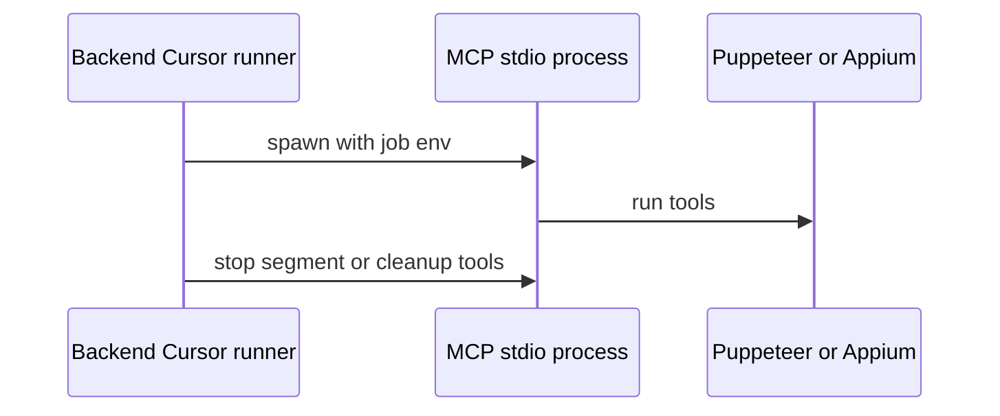

# mcp.md — Model Context Protocol

---

## Pendahuluan

Dokumen ini menjelaskan bagaimana agent runtime memanggil tool automation lewat **MCP**: in-process (OpenAI-compatible / knitto-agent) vs stdio subprocess (Cursor), plus **katalog tool** yang di-`registerTool` untuk browser dan mobile.

---

## Tujuan Dokumen

- Mempertegas dua mode transport dan dampaknya ke session/recording/cleanup
- Mendaftar tool MCP yang tersedia di masing-masing server
- Acuan saat menambah tool atau mengubah env MCP

---

## Ruang Lingkup

Mencakup: registrasi tool (nama + fungsi ringkas), env job, segment managed flags, cleanup spawn.

Schema input/output lengkap: sumber di `apps/backend/src/{automation,mobile-automation}/libs/tools/`.

---

## 1. Entry points & registrasi

| Server | Entry | Registry export |
|--------|-------|-----------------|
| Browser | `apps/backend/src/platforms/browser/mcp-stdio-server.ts` | `platforms/browser/registry.ts` |
| Mobile | `apps/backend/src/platforms/mobile/mcp-stdio-server.ts` | `platforms/mobile/registry.ts` |

Klien in-process memuat tool yang sama lewat `in-process-mcp-client.ts` (browser / mobile).

Env builder: `core/automation-mcp-config.ts` (`automationMcpEnv`, `mobileMcpEnv`).

Urutan di stdio server = urutan `server.registerTool(...)`.

---

## 2. Browser MCP — tools terdaftar

Prefix: **`browser_*`** (W6 cutover; sebelumnya `automation_*`). Total **20** tool.

| Tool | Fungsi ringkas |
|------|----------------|
| `browser_get_app_memory` | Baca memory web (`memory/{appId}.md`) |
| `browser_update_app_memory` | Tulis/update memory (prefer upsert section) |
| `browser_navigate` | Buka URL di sesi browser |
| `browser_get_page_snapshot` | Snapshot aksesibilitas + ref elemen (`e12`, …) |
| `browser_click` | Klik via semantic locator |
| `browser_click_at` | Klik koordinat (x, y) |
| `browser_fill` | Isi input via locator |
| `browser_assert_text` | Assert teks di body (contains / exact / regex) |
| `browser_assert_visible` | Assert elemen locator terlihat |
| `browser_take_screenshot` | Screenshot PNG bukti |
| `browser_scroll` | Scroll halaman / ke elemen |
| `browser_press_key` | Kirim key (Enter, Tab, dll.) |
| `browser_hover` | Hover elemen |
| `browser_select_option` | Pilih opsi `<select>` / combo |
| `browser_wait_for` | Tunggu locator / teks / timeout |
| `browser_go_back` | History back |
| `browser_go_forward` | History forward |
| `browser_upload_file` | Upload file ke input (dari storage) |
| `browser_close_browser` | Tutup sesi Puppeteer |
| `browser_stop_test_case_segment` | Stop video segment multi-TC (orchestrator / Cursor) |

Locator: ref snapshot, `role`+`name`, label/placeholder/teks — lihat [browser.md](browser.md).

---

## 3. Mobile MCP — tools terdaftar

Prefix: `mobile_*`. Total **16** tool.

| Tool | Fungsi ringkas |
|------|----------------|
| `mobile_launch_app` | Launch / activate app (`appPackage`, opsional deep link) |
| `mobile_get_screen_snapshot` | Snapshot UI hierarchy + ref |
| `mobile_tap` | Tap via semantic locator |
| `mobile_tap_at` | Tap koordinat layar (px) |
| `mobile_scroll` | Scroll / swipe |
| `mobile_input_text` | Isi EditText / input via locator |
| `mobile_take_screenshot` | Screenshot PNG layar Android |
| `mobile_upload_file` | Push file ke device + set path input |
| `mobile_get_app_memory` | Baca memory mobile (`memory/mobile/`) |
| `mobile_update_app_memory` | Update memory mobile |
| `mobile_press_key` | Key Android: BACK, HOME, ENTER, TAB, DEL, MENU |
| `mobile_assert_visible` | Assert elemen locator terlihat |
| `mobile_wait_for` | Tunggu locator / teks di source / timeout |
| `mobile_close_app` | Force-stop app (`terminateApp`); session tetap hidup |
| `mobile_close_session` | Hapus sesi Appium + release device pool |
| `mobile_stop_test_case_segment` | Stop video segment multi-TC |

Urutan close single-TC: **`mobile_close_app` → `mobile_close_session`**. Multi-TC: agent dilarang close — orchestrator yang memanggil (lihat [hybrid.md](hybrid.md), [mobile.md](mobile.md)).

---

## 4. Ringkasan banding

| Area | Browser | Mobile |
|------|---------|--------|
| Buka konteks | `browser_navigate` | `mobile_launch_app` |
| Snapshot | `browser_get_page_snapshot` | `mobile_get_screen_snapshot` |
| Interaksi utama | click / fill / select / hover | tap / input_text / scroll |
| Assert | text + visible | visible |
| Navigasi history | go_back / go_forward | — (pakai `press_key` BACK) |
| Tutup | `close_browser` | `close_app` lalu `close_session` |
| Segment multi-TC | `browser_stop_test_case_segment` | `mobile_stop_test_case_segment` |
| Memory | `browser_*_app_memory` | `mobile_*_app_memory` |

Hybrid (browser + mobile dalam satu job): agent memakai **kedua** set tool sesuai platform TC — bridged lewat composite / orchestrator, bukan satu MCP server gabungan.

---

## 5. In-process

Client MCP di process backend yang sama dengan map session Puppeteer/Appium. Cocok untuk OpenAI-compatible (knitto-agent) dan cleanup `cleanupMode: "in-process"`. Stdio (Cursor) dan in-process mendaftarkan **set tool yang sama** (termasuk `*_stop_test_case_segment`).

---

## 6. Cursor stdio

- Saat `segmentManaged: true` → `AUTOMATION_MULTI_TC=1` / `MOBILE_MULTI_TC=1`
- Cleanup close: `segmentManaged: false` + `FORCE_CLOSE=1`, dan **tetap set** `MULTI_TC=1` agar early `createSession` tidak jalan; close guard di-bypass oleh `FORCE_CLOSE`

### Cleanup vs early session (mobile)

Sebelumnya cleanup menghapus `MOBILE_MULTI_TC` → boot MCP memanggil `createSession()` (karena `recordVideo`) → app relaunch setelah force-stop.

Mitigasi sekarang:

1. `cursor-mcp-tool-runner`: saat `forceClose`, set ulang `MOBILE_MULTI_TC=1` / `AUTOMATION_MULTI_TC=1`
2. `mcp-stdio-server` (mobile): skip early `createSession` jika `FORCE_CLOSE` atau `MULTI_TC`

Close tool tetap jalan lewat state file / ADB (`terminateMobileAppFromState`, `closeMobileSessionFromState`) tanpa membuat session baru.

---

## 7. Close guard

`isMultiTcCloseBlocked(jobId)` — block `browser_close_browser` / `mobile_close_app` / `mobile_close_session` selama job multi-TC managed, kecuali `FORCE_CLOSE`.

---

## 8. Docker MCP

`docker.env`: `AUTOMATION_MCP_COMMAND=node`, path ke `dist/.../mcp-stdio-server.js` (compiled), bukan `tsx` source.
