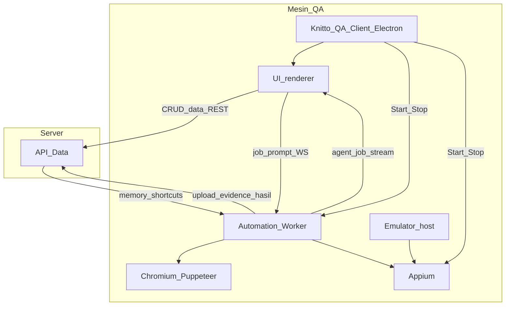
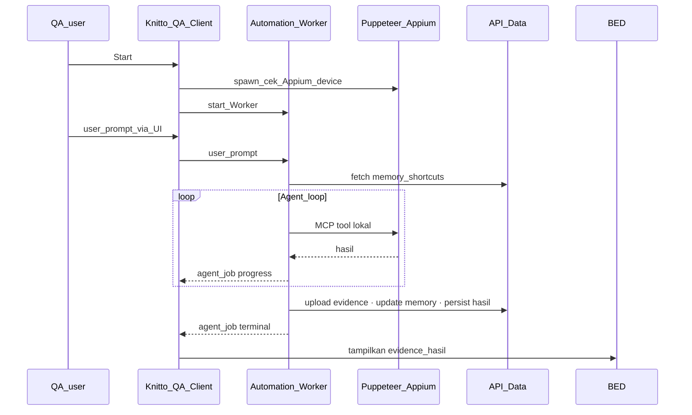

# Rencana Arsitektur Target (`ARCH`)

> **Plan ID:** `ARCH`  
> **Depends on:** Stakeholder align (`ROADMAP` W0)  
> **Unlocks:** `API-DATA`, `AUTH`, `AGENT`, `MCP`, `ELECTRON`  
> **Related:** [plan-roadmap.md](plan-roadmap.md) · [plan-api-data.md](plan-api-data.md) · [plan-media.md](plan-media.md) · [plan-job-lifecycle.md](plan-job-lifecycle.md) · [plan-auth.md](plan-auth.md) · [plan-agent-runtime.md](plan-agent-runtime.md) · [plan-mcp.md](plan-mcp.md) · [plan-electron.md](plan-electron.md)

Dokumen ini adalah **keputusan arsitektur final** untuk mengintegrasikan **knitto-agent-automation** ke ekosistem yang sudah punya Backend dengan test suites.

As-is: [architecture.md](../architecture.md), [api.md](../api.md), [mcp.md](../mcp.md), [hybrid.md](../hybrid.md).

> **As-is vs target:** [architecture.md](../architecture.md) = sistem sekarang. Dokumen ini = **arah target** (data vs eksekusi + distribusi QA non-teknis).

---

## 1. Ringkasan eksekutif

Target: **satu Knitto Api Automation QA Data** (server) untuk suites, hasil, screenshot/video, memory, dan prompt shortcuts; plus **satu Knitto Automation QA Worker** di mesin QA yang menjalankan agent, Puppeteer, Appium, dan emulator — model eksekusi seperti monolit sekarang, tapi **bukan** Backend domain kedua.

Distribusi ke QA/tester **non-teknis**: **Knitto Automation QA Client (Electron)** — install sekali → tombol **Start** → kerja. Appium dan Worker diurus tim teknis di balik installer; QA tidak disuruh install Docker, Appium, atau CLI.

Ditolak sebagai target utama: dua BE domain setara; orchestrator remote yang me-relay tiap tool call ke client; membebankan setup teknis ke QA; device farm sebagai path utama dokumen ini.

---

## 2. Keputusan final

| Keputusan | Ya / Tidak | Keterangan |
|---|---|---|
| Satu **Knitto Api Automation QA Data** (API Data) | **Ya** | Suites, hasil run, evidence persist, memory, prompt shortcuts |
| **Knitto Automation QA Worker** di mesin QA | **Ya** | Agent runtime (Cursor \| OpenAI-compatible) + orchestrator + MCP + Puppeteer + Appium + device pool — lihat [plan-agent-runtime.md](plan-agent-runtime.md) |
| **Knitto Automation QA Client** (Electron) | **Ya** | Lapisan distribusi: installer + Start/Stop + status device + UI |
| Suruh QA install Docker / Appium / CLI manual | **Tidak** | Beban setup di tim teknis / isi paket client |
| Device farm sebagai path utama | **Tidak** | Di luar scope plan ini; eksekusi tetap di mesin QA |
| Bundle Appium “sekali selesai, zero maintenance” | **Tidak** | Bundle/spawn bisa; teknis tetap maintain runtime di balik installer |
| Sebut worker sebagai “BE kedua” | **Tidak** | Worker = eksekusi lokal; BE = pemilik data |
| Orchestrator remote + relay tool ke client | **Tidak** | Lebih rapuh; ditolak untuk path utama |
| Puppeteer/Appium di dalam tab browser biasa | **Tidak** | Driver di proses Worker (dihidupkan Client) |
| Init Chromium/Appium di API Data remote | **Tidak** | Browser & device di mesin yang sama dengan QA |

### Istilah resmi (wajib konsisten)

| Nama produk | Nama pendek / Plan | Bukan | Arti |
|---|---|---|---|
| **Knitto Api Automation QA Data** | API Data / `ARCH` data plane | “BE otomasi”, “BE kedua” | Service server: data & API persistensi |
| **Knitto Automation QA Worker** | Automation Worker | “BE QA”, “BE kedua” | Proses di PC QA: job agent + driver |
| **Knitto Automation QA Client** | Client (Electron) | pengganti Appium; “BE ketiga” | Shell desktop: installer UX, Start/Stop, status, UI (renderer); membungkus Worker |
| **UI client** | — | tempat menjalankan Puppeteer | Renderer Electron (UI chat/monitoring) |

---

## 3. Topologi target

**Deployable di mesin QA:** Knitto QA Client (UI + Start) → Automation Worker + Appium; emulator di host.  
**Deployable di server:** API Data.  
**Domain Backend:** hanya **1** (API Data).



| Unit | Di mana | Isi |
|---|---|---|
| **API Data** | Server | Test suites, catalog, hasil run, storage screenshot/video, memory, prompt shortcuts, meta file |
| **Automation Worker** | Mesin QA | Agent runtime (Cursor \| OpenAI-compatible), queue, multi-TC orchestrator, MCP, Puppeteer, Appium client, device pool |
| **Knitto QA Client** | Mesin QA | Electron: Start/Stop, health device, UI; spawn/cek Appium + Worker di baliknya |
| **Appium** | Mesin QA | Runtime mobile — dependency yang teknis kemas; QA tidak configure manual |
| **Emulator** | Mesin QA (host) | BlueStacks/dll. — biasanya IT/preinstall; jarang di-bundle Electron |

`packages/shared` tetap **library** kontrak (Zod/WS/parser), dipakai Client, Worker, dan API Data.

---

## 4. Distribusi client untuk QA non-teknis (Electron)

### Verdict

Electron dipakai karena **QA non-teknis tidak boleh digiring ke Docker/Appium/terminal** — bukan karena framework “lebih keren”. Electron = **remote control berwajah ramah**: satu Setup.exe, tombol Start/Stop, status Siap/Belum siap. **Appium tetap harus ada di mesin itu**; Client hanya menyembunyikan kompleksitas. Tim teknis yang mengurus isi runtime di belakang paket.

Rencana teknis packaging / signing / update: **`ELECTRON`** ([plan-electron.md](plan-electron.md)) — dikerjakan setelah Worker + data path stabil.

### Yang QA lihat vs yang teknis siapkan

```text
QA lihat                         Teknis siapkan di paket
──────────────────────────────   ────────────────────────────────
Icon Knitto QA                   Electron shell
Tombol Start / Stop              + Automation Worker
Status: Siap / Belum siap        + Appium (spawn/cek lokal)
UI chat / suite                  + pesan error manusiawi
                                 + (opsional) helper cek BlueStacks
        │
        └── sync ke API Data
```

### UX QA

1. Install `KnittoQA-Setup.exe` (dari IT / link internal) — Next → Finish.  
2. Buka **Knitto QA**.  
3. (Jika perlu) wizard: “Nyalakan BlueStacks dulu”, lalu **Cek lagi**.  
4. Klik **Start** → status Siap.  
5. Kerjakan tes di UI.  
6. **Stop** atau tutup app bila selesai.

### Saat Start (di belakang layar)

1. Cek/spawn Appium lokal (window teknis disembunyikan bila memungkinkan).  
2. Cek ADB/device → hijau “Siap” atau pesan jelas “Buka emulator, lalu Cek lagi”.  
3. Start Automation Worker.  
4. UI connect ke Worker + API Data.  
5. Stop: matikan Worker (+ opsional Appium), rapikan proses.

### Tanggung jawab

| Pihak | Urus |
|---|---|
| **QA** | Install client sekali; buka emulator jika diminta UI; Start; pakai UI; Stop |
| **Tim teknis** | Isi installer (Worker, Appium/runtime, updater, signing); cocokkan driver dengan emulator standar |
| **IT** | Deploy `.exe` / allowlist antivirus; idealnya preinstall BlueStacks di PC QA |

### Batas realistis

- Electron **tidak** menghilangkan kebutuhan proses mirip Appium di mesin QA.  
- BlueStacks/emulator **biasanya tetap di luar** bundle (lisensi, ukuran); strategi: IT golden image atau satu kali install dari kanal resmi, bukan “suruh QA paham ADB”.  
- Packaging, code signing, update driver = **biaya tim teknis** berkelanjutan.

### Plus / minus singkat

| Plus | Minus (di pihak teknis) |
|---|---|
| Satu mental model untuk QA non-teknis | Installer Windows, signing, antivirus |
| Tidak ada onboarding Docker/CLI | Maintain Appium/driver vs BlueStacks standar |
| Pesan error bisa ramah | Tiket “Start merah” tetap ke teknis (lebih baik daripada QA di terminal) |

---

## 5. Kepemilikan: data vs eksekusi

### 5.1 Pindah / hidup di API Data

| Item | Peran API Data | Catatan |
|---|---|---|
| **Screenshot / video / media library** | Persist MinIO + metadata (`MEDIA`) | Worker **capture** → upload API; bukan blob di kolom result |
| **Memory** (browser & mobile) | CRUD (`API-DATA` G4) | Worker fetch sebelum/saat job; update lewat API |
| **Prompt shortcuts / template** | CRUD (`API-DATA` G4) | UI compose; penyimpanan di API Data |
| **Test suites / hasil run** | Catalog (existing RO) + `agent_runs` (`API-DATA`) | Mapping `agentJobId` ↔ `runId` → `JOB` |
| **Meta storage / file manager** | Library di `MEDIA` | Attachment = `mediaId`, bukan path disk monolit |

### 5.2 Tetap di Automation Worker

| Item | Peran Worker |
|---|---|
| Agent loop / runtime / queue | Putuskan tool, jalankan job — lihat `AGENT` |
| MCP `browser_*` / `mobile_*` (target; as-is `automation_*`) | Eksekusi tool lokal — lihat `MCP` |
| Chromium / Puppeteer | Browser di mesin QA |
| Appium + device pool | Session device lokal |
| Capture evidence | PNG/mp4 → upload ke API Data |

### 5.3 Knitto QA Client (UI + lifecycle)

| Item | Peran Client |
|---|---|
| Chat, progress, checklist, tampil evidence | Render dari stream Worker + URL API Data |
| Settings / shortcuts / memory UI | Form → API Data |
| Kirim / cancel job | Ke Worker (WS) |
| Start / Stop Worker & Appium | Main process Electron |
| Status emulator / device | Cek + pesan wizard; **bukan** minta QA jalankan skrip CLI |

### 5.4 Matriks ringkas

| Fitur | Client UI | Worker | API Data |
|---|---|---|---|
| Start/Stop runtime | ✅ | dihidupkan Client | — |
| UI chat & monitoring | ✅ | stream | — |
| Job prompt / cancel | kirim | ✅ eksekusi | status/hasil |
| Pilih tool (agent) | — | ✅ | — |
| Puppeteer / Appium | Start/cek saja | ✅ | ❌ |
| Emulator | wizard/status | konsumsi | ❌ |
| Screenshot/video persist | tampilkan | capture+upload | ✅ |
| Memory / prompt shortcuts | UI | fetch/update API | ✅ |
| Test suites | UI | laporkan hasil | ✅ |

---

## 6. Alur end-to-end



1. QA Start di Client; Appium + Worker siap di host yang sama.  
2. UI mengirim job ke **Worker**.  
3. Worker fetch memory/shortcuts dari **API Data**, jalankan agent + tools lokal.  
4. Progress Worker → UI.  
5. Evidence & hasil → **API Data**.  
6. UI (dan suites) baca data jangka panjang dari **API Data**.

---

## 7. Mengapa model ini

| Alasan | Penjelasan |
|---|---|
| **Robust di mesin QA** | Orchestrator + driver co-locate → latency rendah, tanpa hop tool_call per aksi |
| **Data terpusat** | Suites, evidence, memory, prompt di satu BE |
| **Bukan “2 BE domain”** | 1 Backend domain; Worker = eksekutor; Client = bungkus UX |
| **Constraint fisik** | Chromium & emulator di PC QA; tidak diinit di API Data |
| **QA non-teknis** | Electron Start/Stop; teknis urus Appium di baliknya |
| **Alternatif ditolak** | Relay tool server→client; Docker/CLI ke QA; device farm sebagai default plan ini |

Secara deploy: API Data + (Client membungkus Worker/Appium di PC QA). Secara produk: **1 BE + 1 Worker + 1 Client**.

---

## 8. Pemetaan dari monolit as-is

Referensi modul hari ini: [architecture.md](architecture.md) §3.1.

| Modul monolit (`apps/backend` dll.) | Target |
|---|---|
| HTTP routes untuk memory, shortcuts, evidence serve, file meta | **API Data** |
| Domain test suites / hasil (ekosistem existing) | **API Data** |
| WsHub job, bridge registry & runners | **Automation Worker** |
| `services/shared/` queue, orchestrator, prompt-builder, handoff | **Automation Worker** |
| `automation/*` / `mobile-automation/*` | **Automation Worker** |
| Capture screenshot/video | **Worker** → persist **API Data** |
| App memory / prompt-shortcut **storage** | **API Data** |
| Mobile device presence / SSE | **Worker** + status di **Client** |
| `apps/frontend` | **UI di Knitto QA Client** (renderer) |
| Skrip BlueStacks / `instances:*` | Dipicu **Client**/IT; bukan tugas QA CLI |
| Appium process | Dihidupkan **Client** (isi paket teknis) |
| `packages/shared` | Shared library |

> Drift as-is: memory, shortcuts, evidence masih di monolit. Target: persistensi ke API Data; eksekusi di Worker; QA memakai Client Electron.

---

## 9. Transport

| Jalur | Arah | Isi |
|---|---|---|
| **UI ↔ Worker (WS)** | Job | `user_prompt`, cancel, stream `agent_job`, status bridge |
| **UI ↔ API Data (REST)** | Data | Suites, memory, shortcuts, evidence URL, file meta |
| **Worker ↔ API Data (REST/API)** | Sync | Fetch memory/shortcuts; upload evidence; persist hasil / `jobId` |
| **Client main ↔ Worker/Appium** | Lifecycle | Start/Stop, health check device (IPC/lokal) |

Job agent ke **Worker**, bukan ke API Data. API Data tidak menjalankan MCP tools.

---

## 10. Non-goals & glossary

### Non-goals

- Tidak mendefinisikan Worker atau Client sebagai Backend domain.  
- Tidak memindahkan Puppeteer/Appium ke tab browser biasa.  
- Tidak init Chromium/emulator di API Data.  
- Tidak memakai relay tool_call server→client sebagai arsitektur utama.  
- Tidak membebankan Docker / Appium CLI / terminal ke QA.  
- Tidak menjadikan device farm path utama dokumen ini.  
- Electron **bukan** syarat agar arsitektur inti jalan — dibangun **setelah** Worker + API Data stabil (fase migrasi).

### Glossary singkat

| Istilah | Arti |
|---|---|
| **Knitto Api Automation QA Data** (API Data) | Service server pemilik suites & persistensi |
| **Knitto Automation QA Worker** | Proses di mesin QA untuk agent + driver |
| **Knitto Automation QA Client** | Electron: installer UX, Start/Stop, UI |
| **Evidence / Media** | Screenshot/video; capture di Worker, simpan MinIO + metadata API Data |
| **Memory** | Markdown per app/package; di API Data |
| **Prompt shortcuts** | Template prompt; di API Data |
| **MCP tools** | `browser_*` / `mobile_*` (target); hanya di Worker — `MCP` |

---

## 11. Fase migrasi

Urutan detail lintas plan: [plan-roadmap.md](plan-roadmap.md) §3.

| Fase | Plan ID | Hasil | Selesai jika |
|---|---|---|---|
| **0. Align** | `ARCH` + `ROADMAP` | Istilah seragam | Stakeholder setuju |
| **1. API runs** | `API-DATA` + `AUTH` | `agent_runs` / cases | Write tanpa legacy queues |
| **2. Job correlation** | `JOB` | `agentJobId` ↔ `runId` | Create-before-WS |
| **3. Media MinIO** | `MEDIA` | Library + tautan run | Upload + preview |
| **4. Memory/shortcuts** | `API-DATA` G4 | Persist di BE | Disk monolit bukan SoT |
| **5. Agent + MCP** | `AGENT` + `MCP` | 2 runtime; `browser_*` | Cutover UI/tools |
| **6. Harden Worker** | — | Retry, offline, device lock | Stabil di mesin QA |
| **7. QA Client** | `ELECTRON` | Installer + Start/Stop | QA non-teknis tanpa CLI |

Interim sebelum fase 7: **golden image** PC QA (Worker+Appium preinstall).

---

## 12. Keputusan ringkas

| Pertanyaan | Jawaban |
|---|---|
| Berapa BE domain? | **Satu** — API Data |
| Apa yang di mesin QA? | **Knitto QA Client** + **Automation Worker** + Appium + emulator |
| Di mana screenshot, memory, prompt? | **API Data** |
| Di mana Puppeteer & Appium? | **Worker / host QA** (dihidupkan Client) |
| Apakah ini 2 BE? | **Tidak** — 1 BE + 1 Worker + 1 Client |
| Bagaimana QA non-teknis menjalankan mobile? | **Install Knitto QA Client → Start** (Appium diurus teknis di baliknya) |
| Referensi as-is? | [architecture.md](architecture.md) |
