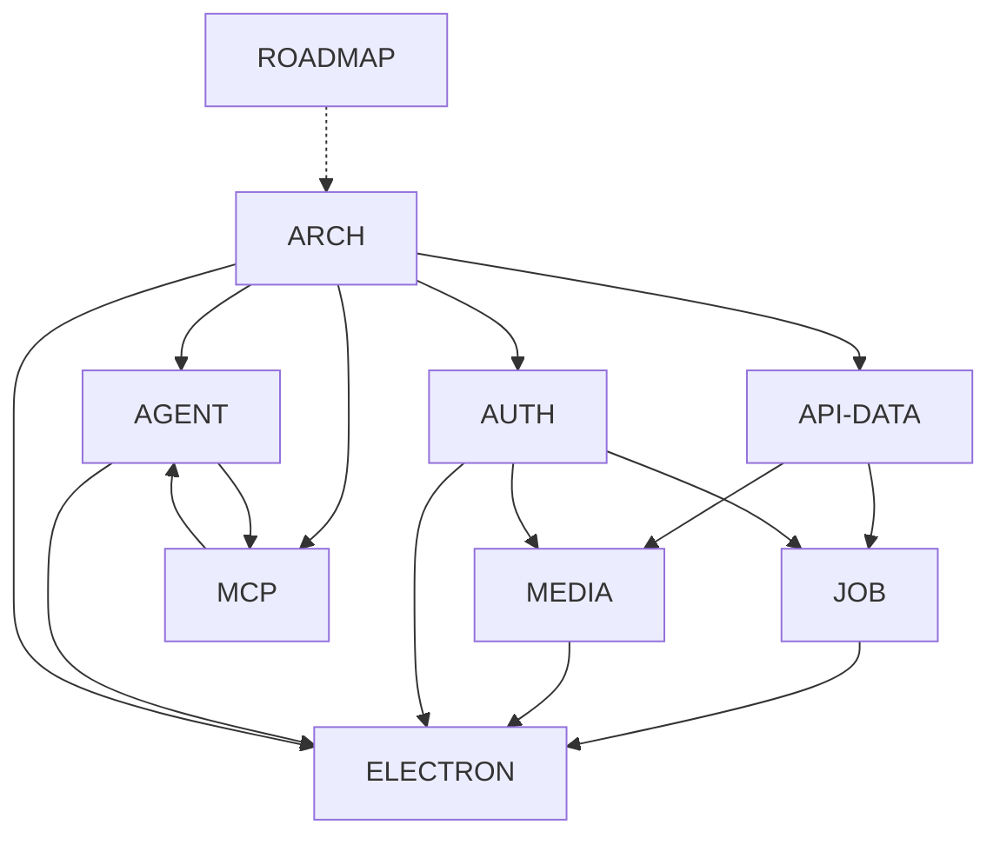

# Roadmap & peta dependensi plan

> **Plan ID:** `ROADMAP`  
> **Depends on:** — (indeks meta)  
> **Unlocks:** semua plan lain (urutan baca & kerja)  
> **Related:** seluruh file di `docs/plans/`

Dokumen ini adalah **satu sumber** untuk: nama plan, dependensi, dan urutan implementasi.  
Setiap plan lain wajib punya header **Plan ID / Depends on / Unlocks**.

---

## 1. Skema nama (wajib konsisten)

| Plan ID | File | Fokus singkat | Nama produk (bila relevan) |
|---|---|---|---|
| `ROADMAP` | [plan-roadmap.md](plan-roadmap.md) | Indeks + dependensi + urutan | — |
| — | [TODO.md](TODO.md) | Checklist implementasi per wave (centang) | — |
| `ARCH` | [plan-architecture.md](plan-architecture.md) | Topologi data + worker + client | Data / Worker / Client |
| `API-DATA` | [plan-api-data.md](plan-api-data.md) | API/tabel `agent_runs`, cases, logs, memory, shortcuts | Knitto Api Automation QA Data |
| `MEDIA` | [plan-media.md](plan-media.md) | Library MinIO: `agent_media*`, upload, tautan run | bucket `automation-qa` |
| `JOB` | [plan-job-lifecycle.md](plan-job-lifecycle.md) | `agentJobId` ↔ `runId`, state, cancel | — |
| `AUTH` | [plan-auth.md](plan-auth.md) | JWT / service token, ACL project, secrets | JWT user (MVP) |
| `AGENT` | [plan-agent-runtime.md](plan-agent-runtime.md) | Cursor \| OpenAI-compatible (knitto-agent) | Worker |
| `MCP` | [plan-mcp.md](plan-mcp.md) | `browser_*` / `mobile_*`, token, Puppeteer | Worker |
| `ELECTRON` | [plan-electron.md](plan-electron.md) | Installer, Start/Stop, packaging | Knitto Automation QA Client |

Saat merujuk antar dokumen, tulis **Plan ID** + link file, mis. `MEDIA` ([plan-media.md](plan-media.md)).

---

## 2. Graf dependensi

| Plan | Depends on (wajib selesai konsep / MVP dulu) | Unlocks |
|---|---|---|
| `ARCH` | Stakeholder align | Semua plan teknis |
| `API-DATA` | `ARCH` | `MEDIA`, `JOB`, memory API, **list/history runs (W4)** |
| `MEDIA` | `API-DATA`, `AUTH` (untuk ACL upload) | Evidence persist, FE media folder; dual picker history di W4 |
| `JOB` | `API-DATA`, `AUTH` | Wire Worker↔BE status; cancel konsisten; history FE di W4 |
| `AUTH` | `ARCH` | Write aman ke BE/Media; Client secrets |
| `AGENT` | `ARCH` | Path LLM produk; butuh `MCP` untuk tools |
| `MCP` | `ARCH` | Tools untuk `AGENT`; memory tool → storage `API-DATA`/`MEDIA` belakangan |
| `ELECTRON` | `ARCH` + Worker stabil (`AGENT`+`MCP`+`JOB`+ harden) + data path (`MEDIA`) + **W4–W7** | Distribusi QA non-teknis — **W8 BLOCKED** sampai prasyarat selesai |

**Coupling lembut:** `AGENT` ↔ `MCP` boleh paralel setelah `ARCH`, tapi cutover UI agent menunggu MCP rename atau dual-register.

---

## 3. Urutan implementasi (gelombang kerja)

| Wave | Plan ID | Hasil “selesai jika” |
|---|---|---|
| **W0** | `ROADMAP` + `ARCH` | Istilah & topologi disetujui |
| **W1** | `AUTH` (MVP JWT) + `API-DATA` G1–G2 | `agent_runs` / cases API hidup |
| **W2** | `JOB` | FE create run → WS job → PATCH status tanpa race |
| **W3** | `MEDIA` | Upload MinIO + tautan run; FE preview |
| **W4** | `API-DATA` history + `MEDIA` picker | List/history `agent_runs`; Media library: Uploaded \| Dari run |
| **W5** | `API-DATA` G4 (memory/shortcuts) | Disk monolit bukan sumber kebenaran |
| **W6** | `AGENT` + `MCP` (paralel OK) | 2 runtime UI; `browser_*` cutover |
| **W7** | Harden Worker | Retry upload, offline buffer, device lock 1-host |
| **W8** | `ELECTRON` (**BLOCKED** — planning only) | Installer + Start/Stop — **jangan mulai** sampai W2–W7 stabil |

Interim sebelum W8: golden image PC QA (Worker+Appium) — lihat `ARCH` §11.

---

## 4. Apa yang sengaja dipecah

| Dulu campur di… | Sekarang |
|---|---|
| Draft BE: runs + media + auth singkat | `API-DATA` + `MEDIA` + `AUTH` |
| Architecture: Electron UX saja | `ARCH` (keputusan) + `ELECTRON` (teknis packaging) |
| Gap “siapa create runId” | `JOB` |
| Gap roadmap lintas plan | `ROADMAP` (dokumen ini) |

---

## 5. Open decisions (kunci di plan pemilik)

| Keputusan | Pemilik | Status | Locked value |
|---|---|---|---|
| Ad-hoc run tanpa `testSuiteId` | `JOB` + `API-DATA` | **Locked** | Diizinkan (`test_suite_id` NULL) |
| Prefix tabel `agent_` vs `kaa_` | `API-DATA` | **Locked** | `agent_` |
| Bucket MinIO strategy | `MEDIA` | **Locked** | Satu bucket **`automation-qa`** + prefix path |
| Retention orphan media | `MEDIA` | **Locked** | **D2** — auto-hapus orphan setelah **30 hari** |
| Merge UI agent runs ke tester lama | `API-DATA` / produk | **Locked** | Tidak dulu — UI agent terpisah |
| Worker auth MVP | `AUTH` | **Locked** | Forward **JWT user** |

W0 keputusan produk: **selesai** (semua Locked).

---

## 6. Non-goals roadmap

- Tidak menggabungkan lagi media ke dalam hasil TC sebagai blob kolom.  
- Tidak menulis legacy `test_queues` / `test_results` / `test_objects`.  
- Tidak memulai implementasi `ELECTRON` (W8) sebelum Worker + data path + harden stabil (**W2–W7**); W8 = **BLOCKED / planning only**.  
- Tidak dump semua evidence run ke root Media library tanpa konteks run (picker “Dari run” = W4).  
- Device farm bukan path utama (`ARCH`).
