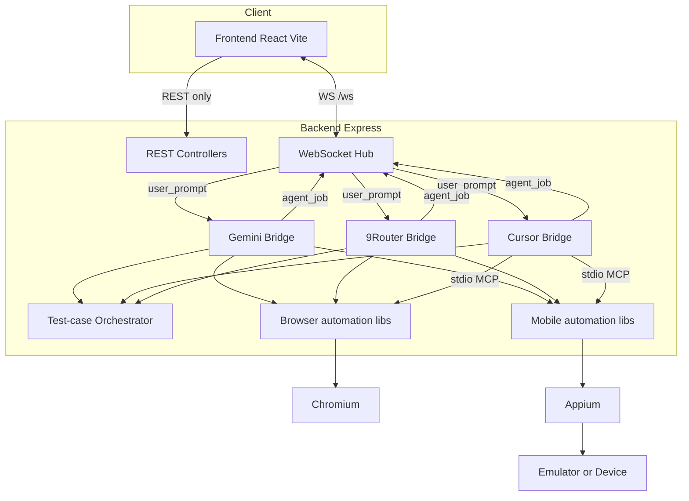

# Arsitektur Sistem Knitto Agent Automation

---

## Pendahuluan

Dokumen ini mendefinisikan arsitektur sistem **Knitto Agent Automation** — monorepo web (React) + API (Express) yang menjalankan AI agent untuk otomasi browser (Puppeteer) dan Android (Appium).

Arsitektur memenuhi tiga tuntutan:

1. **Keandalan tool** — agent hanya bertindak lewat MCP tools dengan schema, bukan ad-hoc script di UI
2. **Isolasi platform** — browser dan mobile punya MCP/runtime terpisah; hybrid digabung di orchestrator
3. **Maintainability** — kontrak bersama di `@knitto/shared`; dokumentasi domain di file arsitektur turunan

---

## Tujuan Dokumen

- Menjelaskan high-level architecture dan batas tanggung jawab komponen
- Menjadi acuan konsistensi fitur baru
- Membantu developer baru sebelum membaca seluruh source

---

## Ruang Lingkup

Mencakup: high-level architecture, monorepo, data/event flow, deployment overview.

Tidak mencakup detail domain — lihat:

| Topik | Dokumen |
|-------|---------|
| Puppeteer, recording browser | [browser.md](browser.md) |
| Appium, ADB, device pool | [mobile.md](mobile.md) |
| Multi-TC orchestrator | [hybrid.md](hybrid.md) |
| MCP in-process vs stdio | [mcp.md](mcp.md) |
| Compose & dual ADB | [docker.md](docker.md) |
| Env vars | [environment.md](environment.md) |
| REST / WS | [api.md](api.md) |

---

## 1. High-Level Architecture

Satu proses **backend** menjalankan HTTP API, WebSocket hub, dan bridge agent. Frontend hanya UI + client.



Alur prompt agent (bukan REST):

1. UI kirim `user_prompt` lewat **WebSocket Hub** (`/ws`)
2. Hub memanggil `bridge.handleUserPrompt(...)` (Gemini / Cursor / 9Router)
3. Bridge mengantri job (queue internal per bridge) → runner; multi-TC/hybrid lewat **orchestrator**
4. Runner memakai browser/mobile libs (Puppeteer / Appium; Cursor via MCP stdio)
5. Progress `agent_job` di-emit balik ke Hub → UI

**REST** terpisah: health, shortcuts, file manager, screenshot/video, mobile devices — bukan jalur kirim prompt.

### Aturan penting

- HTTP listen **segera**; verifikasi API key bridge di background
- Gemini/9Router: MCP **in-process** (shared `sessions` Map)
- Cursor: MCP **subprocess** → state segment/cleanup lewat **file** + tool spawn

---

## 2. Monorepo

| Package | Peran |
|---------|-------|
| `@knitto/frontend` | UI chat, composer, media, settings |
| `@knitto/backend` | API, bridges, automation |
| `@knitto/shared` | Zod schemas, protocol job/TC, tipe shared |

Build order: `shared` → `backend` / `frontend` (Turbo `dependsOn: ["^build"]`).

---

## 3. Layered responsibilities

| Layer | Lokasi | Tanggung jawab |
|-------|--------|----------------|
| UI | `apps/frontend` | Presentasi, koneksi WS, tidak memuat Puppeteer/Appium |
| API | `controllers`, `websocket` | Auth surface publik, streaming event |
| Application | `services/` | Bridge runners, orchestrator, cleanup, segment |
| Domain tools | `automation/`, `mobile-automation/` | MCP tools + driver session |
| Shared contracts | `packages/shared` | Validasi inbound/outbound |

---

## 4. Data flow — single job

```text
UI Send → POST/WS job → Bridge runner → MCP tools →
  browser/mobile actions → screenshoot/agents/{jobId}/ →
  WS agent_job (screenshots, videoUrl) → UI
```

## 5. Data flow — hybrid multi-TC

```text
Parse ## Test Case N → markJobSegmentManaged →
  per TC: start segment → agent → stop segment → handoff →
clear managed → cleanupJobPlatforms (FORCE_CLOSE Cursor)
```

Detail: [hybrid.md](hybrid.md).

---

## 6. Persistence di disk

| Path | Isi |
|------|-----|
| `memory/`, `memory/mobile/` | Agent memory (Git-friendly) |
| `prompt-shortcuts/` | Template prompt |
| `storage/` | File manager |
| `screenshoot/agents/{jobId}/` | PNG, MP4, `.segment-state.json` |

Docker: `memory` & `prompt-shortcuts` **bind-mount**; `storage` & `screenshoot` **named volume**.

---

## 7. Deployment overview

| Mode | Stack |
|------|-------|
| Dev | `pnpm dev` + Appium global (opsional) |
| Docker | `appium` + `backend` + `frontend` Compose |

Lihat [docker.md](docker.md).

---

## 8. Prinsip

- Kontrak di shared package sebelum mengubah FE+BE
- Jangan close platform di tengah multi-TC dari agent
- Evidence default-on; opt-out via env recording flags
